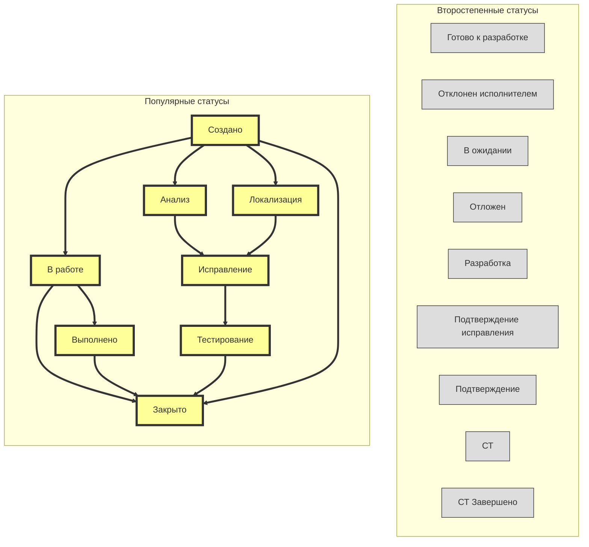

# Жизненный цикл задачи в производстве
Основан на реальных данных о частоте переходов между статусами.
* **Жёлтый** #99FFFF — популярные статусы
* **Серый** #999999 — второстепенные статусы

## Исторические данные частоты переходов
| Переход                                | #    |
| -------------------------------------- | ---- |
| created -> inProgress                  | 1553 |
| inProgress -> closed                   |  949 |
| fixing -> testing                      |  632 |
| inProgress -> done                     |  490 |
| analysis -> fixing                     |  438 |
| testing -> closed                      |  430 |
| created -> analysis                    |  402 |
| done -> closed                         |  345 |
| created -> localization                |  245 |
| localization -> fixing                 |  237 |
| created -> closed                      |  236 |
| verification -> closed                 |   87 |
| inProgress -> created                  |   78 |
| testing -> verification                |   74 |
| readyForDevelopment -> development     |   51 |
| testing -> introduction                |   49 |
| testing -> analysis                    |   43 |
| inProgress -> review                   |   42 |
| analysis -> rejectedByThePerformer     |   40 |
| introduction -> verification           |   40 |
| created -> readyForDevelopment         |   39 |
| review -> done                         |   35 |
| fixing -> analysis                     |   34 |
| rejectedByThePerformer -> closed       |   29 |
| testing -> fixing                      |   29 |
| done -> inProgress                     |   23 |
| development -> st                      |   21 |
| inProgress -> waiting                  |   20 |
| development -> closed                  |   19 |
| waiting -> inProgress                  |   19 |
| analysis -> design                     |   14 |
| design -> readyForDevelopment          |   14 |
| closed -> inProgress                   |   13 |
| localization -> analysis               |   12 |
| st -> closed                           |   12 |
| verification -> analysis               |   10 |
| inProgress -> inProgress               |   10 |
| fixing -> hold                         |   10 |
| closed -> closed                       |   10 |
| fixing -> rejectedByThePerformer       |    9 |
| introduction -> testing                |    9 |
| analysis -> hold                       |    9 |
| rejectedByThePerformer -> analysis     |    8 |
| st -> stCompleted                      |    8 |
| localization -> rejectedByThePerformer |    8 |
| hold -> testing                        |    8 |
| fixing -> localization                 |    8 |
| testing -> localization                |    5 |
| development -> review                  |    5 |
| hold -> analysis                       |    4 |
| at -> introduction                     |    4 |
| introduction -> closed                 |    4 |
| review -> inProgress                   |    4 |
| design -> analysis                     |    3 |
| analysis -> created                    |    3 |
| stCompleted -> ift                     |    3 |
| ift -> at                              |    3 |
| review -> st                           |    3 |
| stCompleted -> at                      |    3 |
| done -> done                           |    3 |
| review -> readyForDevelopment          |    2 |
| at -> closed                           |    2 |
| readyForDevelopment -> design          |    2 |
| verification -> localization           |    2 |
| review -> review                       |    1 |
| development -> development             |    1 |
| analysis -> analysis                   |    1 |
| fixing -> fixing                       |    1 |
| development -> design                  |    1 |
| readyForDevelopment -> closed          |    1 |
| waiting -> waiting                     |    1 |
| created -> created                     |    1 |
