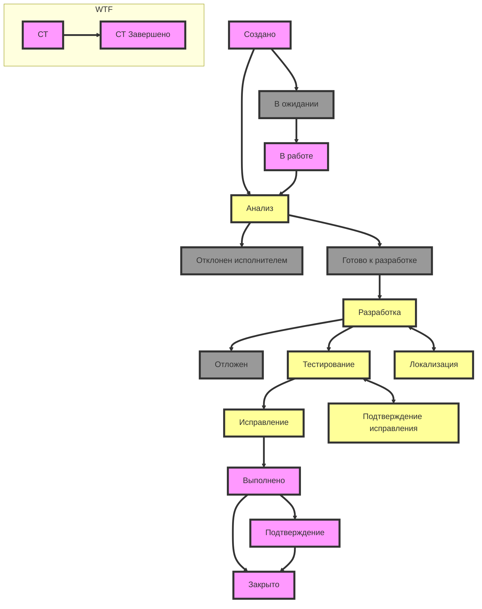

```mermaid
flowchart TB

declined["Отклонен исполнителем"]
wait["В ожидании"]
postponed["Отложен"]
ready2dev["Готово к разработке"]

analysis["Анализ"]
fixing["Исправление"]
dev["Разработка"]
testing["Тестирование"]
approving["Подтверждение исправления"]
localization["Локализация"]


closed["Закрыто"]
created["Создано"]
done["Выполнено"]

subgraph WTF
st["СТ"]
st_done["СТ Завершено"]
end


approve["Подтверждение"]

in_progress["В работе"]

created ==> analysis:::act
created ==> wait:::pass
wait ==> in_progress

in_progress ==> analysis

analysis ==> ready2dev:::pass
analysis ==> declined:::pass
ready2dev ==> dev

dev:::act ==> testing
dev ==> postponed:::pass

testing:::act ==> fixing:::act
testing <==> approving:::act
st ==> st_done

fixing ==> done
done ==> closed
done ==> approve
approve ==> closed

dev <==> localization:::act

classDef default fill:#f9f,stroke:#333,stroke-width:4px;
classDef act fill:#ff9,stroke:#333,stroke-width:4px;
classDef pass fill:#999,stroke:#333,stroke-width:4px;

```
